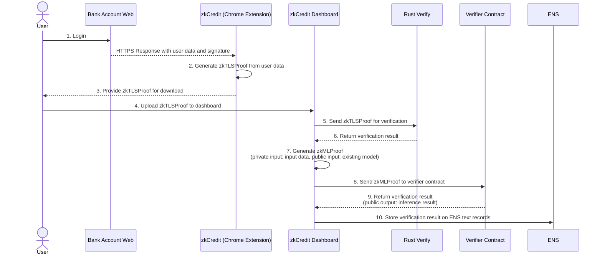

# ChillVille

### Overview


### Problems


### Solution


### Usecase


### Technologies I used


### Architecture


### Development


## zkPass Contract
https://sepolia.etherscan.io/address/0x6390aa9b19d4d2bbda745c03deca0a5775f9b0e2

## MACI Contract
```json
{
    "sepolia": {
        "MACI": "0x31D2EC14148E06C2f0dA87Ec83cCeA3047BA7ea2",
        "InitialVoiceCreditProxy": "0xAb2f7a1D83cB1c334Ca8a0D48b131883e2948fb6",
        "SignUpGatekeeper": "0x85B76d654B5F999802F0AeAe974230da429bB031",
        "Verifier": "0x86c8131cC72a9b2eb649D1DC48bE0e7A3E1dEc5B",
        "PollFactory": "0xc3aABf417Bad3Db4D10a34eF60193E5671C7bc4c",
        "PoseidonT3": "0xccB720352706E9593FcA5746Ca732D69DDFFC379",
        "PoseidonT4": "0xE410499bFE1Cb4251fA9405f10F2F92883bf747C",
        "PoseidonT5": "0x2B82fDe9DA306651b852188c5E99BA5a7583CCf6",
        "PoseidonT6": "0xeFd62f9C83ceAD5355274EC51a0DB04a00E1Bb07",
        "VkRegistry": "0x8375df390AD43aa6b1F6d8dAEA84abf0293f8cBc"
    }
}
```

## zkML Contracts

| contract                   |                                                                                                                   contract address |
| :------------------------- | ---------------------------------------------------------------------------------------------------------------------------------: |
| Ethereum Sepolia    | [0xf2c9d93716e818bda8fd9cd13b692ec5302d5568](https://sepolia.etherscan.io/address/0xf2c9d93716e818bda8fd9cd13b692ec5302d5568#code)|
| RootStock   | [0x677ab31a9d777eedbc88ce2198dce8de9378e78f](https://explorer.testnet.rootstock.io/address/0x677ab31a9d777eedbc88ce2198dce8de9378e78f?__ctab=general ))|
| Morph Holosky    | [0x926a111655a1c856fb46053e95689cc1fe5c3c038257d30d33bb40d11624b9cc](https://explorer-holesky.morphl2.io/tx/0x926a111655a1c856fb46053e95689cc1fe5c3c038257d30d33bb40d11624b9cc)
| Fhenix Testnet    | [0x677aB31a9D777eEdbc88CE2198dcE8de9378E78f](https://explorer.helium.fhenix.zone/address/0x677aB31a9D777eEdbc88CE2198dcE8de9378E78f)|
| Linea Testnet   | [0xb764f3cea872ae3995c3eb0c6e533d6aa6c490bf](https://sepolia.lineascan.build/address/0xb764f3cea872ae3995c3eb0c6e533d6aa6c490bf#code)|

### What's next for


### Implementation Status

| Title          |                                                              URL |
| :------------- | ---------------------------------------------------------------: |
| Demo Movie      |                                      [https://youtu.be/zmENJzrxZRw](https://youtu.be/WDGJQbM-rik)|
| Pitch Doc    |   [chillville-presentation](https://www.canva.com/design/DAGOvSFvJ4E/SfJTYw3sauGSbj1k4oQdDg/edit?utm_content=DAGOvSFvJ4E&utm_campaign=designshare&utm_medium=link2&utm_source=sharebutton) |
| Demo Site     |                                 [chillville-demo](https://eth-sg.vercel.app/)| 

### References
- https://github.com/zkPassOfficial
- https://github.com/privacy-scaling-explorations/maci
- https://github.com/storswiftlabs/python2noir
- https://github.com/storswiftlabs/zkml-noir
